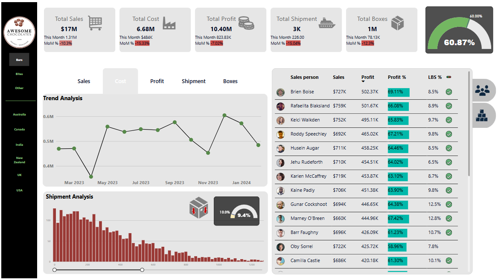

- 👋 Hi, I’m Shoaib Khan
- 👀 I’m Microsoft Certified Business Intelligence Data Analyst
- 💞️ I love transforming data into meaningful visualization.
- 🎓 MBA Graduate - GPA 4.0
- 📫 Reach out to me @ +1(773)751-9594

See the full Healthcare Analysis dashboard here - [App Powerbi Link](https://app.powerbi.com/reportEmbed?reportId=6ba35d2a-c376-4c8c-81c7-37cab0e9efdc&autoAuth=true&ctid=52d48b4c-a96a-4957-8557-71bd33686f3a
)

Healthcare Provider Analysis 
Healthcare Financial Analysis 
Healthcare Trend Analysis 

See the full Sales Analysis dashboard here - [App Powerbi Link](https://app.powerbi.com/reportEmbed?reportId=0899fff0-0cf6-41a2-9717-56ddbd4462e4&autoAuth=true&ctid=52d48b4c-a96a-4957-8557-71bd33686f3a)

See the full Finance KPI dashboard here - [App Powerbi Link](https://app.powerbi.com/reportEmbed?reportId=b8c4a267-0764-4f21-8f70-391c269352f0&autoAuth=true&ctid=52d48b4c-a96a-4957-8557-71bd33686f3a)

